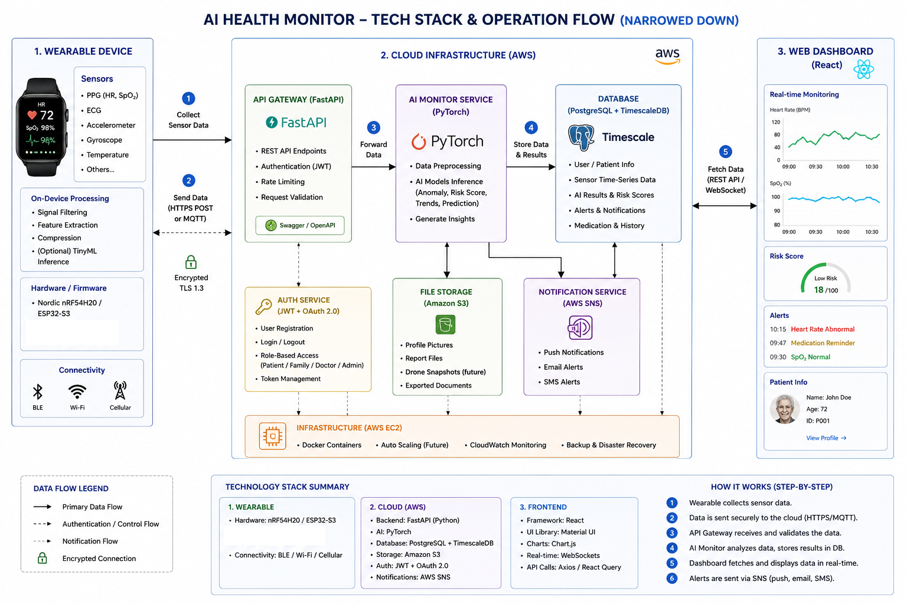

# 🌍 STEM CHALLENGE: PAINTING THE FUTURE OF SMART SOCIETY 2045

Welcome, young founding teams, to your final Capstone Project repository and management workspace! This is where your team will digitize your ideas, architect technological solutions, and build your "investment pitch profile" for the upcoming **Demo Day (Future Tech Showcase)**.

---

## 🛠️ STUDENT GUIDE (READ CAREFULLY BEFORE PROCEEDING)

### 1. How to Initialize Your Team's Project from This Template
* **Step 1:** The Team Representative (Team Leader/CEO) clicks the green **"Use this template"** button in the top right corner ➔ Select **"Create a new repository"**.
* **Step 2:** Name your Repository using the following syntax: `Class_TeamName_ProjectName` (e.g., `STEM02_GreenBrain_WasteSorting`). Set the visibility to **Public**.
* **Step 3:** Go to **Settings** ➔ **Collaborators** ➔ Click **Add people** to invite all team members and your Mentor(s) to co-manage the repository.

### 2. Weekly Submission Roadmap (3-Week Timeline)
* ⏰ **Deadline:** 11:59 PM every Saturday.
* 📦 **Submission Method:** Teams upload image files/documents to the designated directories and update the corresponding content in **[PART II]** below.

| Week | Tasks & Deliverables | Directory to Update on GitHub |
| :--- | :--- | :--- |
| **Week 1 (July 11)** | **Ideation Brainstorming & Systems Thinking Mapping** - Allocate the 5 core roles within the team. - Select 1 major societal challenge (Pollution, Traffic, Healthcare, etc.). - Map out the cause-and-effect system diagram. | 📁 Upload the diagram image to: `/research_system` 📝 Complete the team profile in sections **1** and **2** below. |
| **Week 2 (July 25)** | **Startup Architecture & Technological Solutions** - Define Startup Name, Slogan, and Target Customers. - Propose a solution integrating core technologies (AI, Robotics, IoT, etc.). - Self-evaluate the project idea based on the 50-point matrix. | 📝 Update solution details and technological frameworks in sections **3** and **4** below. |
| **Week 3 (August 1)** | **Smart Society Visual Conception & Final Slide Deck** - Finalize the 2045 Smart Society Visual Conception Drawing. - Synthesize the "Reflection & Knowledge Discovery" section. - Prepare a 15-minute pitch deck for Demo Day. | 📁 Upload the conceptual drawing to: `/design_visuals` 📁 Upload the pitch deck (PDF) to: `/pitch_deck` 📝 Complete all remaining sections below. |

*Note: Once your team is familiar with the workflow, you may delete **PART I** (Student Guide) and keep only **PART II** (Startup Profile) as the main landing page of your project repositor.*

---

# [PART II] STARTUP PROFILE: THE CHRONICLES OF ARCHITECTING SMART SOCIETY 2045

*Students begin documenting their team project from this point forward. Replace placeholder brackets `[...]` with your team's actual information.*

## 🚀 1. STARTUP NAME: [Elderly Companion Robot Network]
* **Slogan:** "Connected Care, Confident Living"
* **Class:** [STEM.02.26]

### 👥 Co-Founding Team (5 Core Roles - 5 Pillars of Synergy)
1. **VU CHAN HUNG** - **CEO (Chief Strategist):**
* **Identity Image / Profile Picture:** [Insert CEO's profile picture or avatar here, or use markdown: ]
* **Responsibilities:** [Coordinate team efforts and align project vision,
Conduct market research on elderly care sector,
Identify target customer segments and market opportunities,
Make executive decisions and strategic planning
]
2. **NGUYEN LAM QUOC HUNG** - **Social Researcher:**
* **Identity Image / Profile Picture:** [Insert Social Researcher's profile picture or avatar here, or use markdown: ]
* **Responsibilities:** [Gather statistical data on elderly care needs in Vietnam,
Map user pain points through interviews and surveys,
Identify community requirements and unmet needs,
Analyze competitive landscape and market demand,
Provide insights on user behavior and preferences
]
3. **[HOANG LAM TAI]** - **Technology Architect:**
* **Identity Image / Profile Picture:** [Insert Technology Architect's profile picture or avatar here, or use markdown: ]
* **Responsibilities:** [Research technical architecture (AI models, IoT infrastructure,
Research IoT sensors, camera technologies, and real-time streaming solutions for elderly care,
Research cloud infrastructure options and system scalability approaches,
Build an interactive online demo/prototype showcasing AI detection capabilities and system workflow,
Document technical architecture and feasibility findings for the project
]
4. **TRAN PHAN LAM** - **UX/Experience Designer:**
* **Identity Image / Profile Picture:** [Insert UX Designer's profile picture or avatar here, or use markdown: ]
* **Responsibilities:** [Design user interface for the web application platform,
Create wireframes and prototypes for the family dashboard,
Develop presentation slides and conceptual visualizations for stakeholders,
Ensure intuitive and engaging web user experience
]
5. **NGUYEN HUYNH NGOC TAM** - **Venture Investor:**
* **Identity Image / Profile Picture:** [Insert Venture Investor's profile picture or avatar here, or use markdown: ]
* **Responsibilities:** [Evaluate project feasibility and technical viability,
Conduct cost-benefit analysis and financial modeling,
Develop comprehensive business model and revenue strategy,
Give pricing strategy,
Research funding opportunities and investment requirements
]

---
## ⚠️ 2. PROBLEM STATEMENT & SYSTEMS THINKING ANALYSIS
* **Core Problem Statement:** Vietnamese elderly fear being alone at home without 24/7 monitoring, while their families suffer constant anxiety about undetected emergencies such as falls or strokes—stripping both of them of freedom, independence, and dignity..
* **Cause-and-Effect Deep Dive:**
  * *Root Causes:* No one can physically monitor elderly parents 24/7 due to modern family structures—adult children work full-time or live separately, leaving elderly at home alone for extended periods.
  * *Direct Consequences:* Undetected Medical Emergencies/ Chronic Anxiety for Families
*Detailed Systems Thinking Map (Attach the image file from the /research_system directory):*

---

## 💡 3. STARTUP ARCHITECTURE & BUSINESS MODEL
* **Target Customers:** Urban middle-to-upper-income families with elderly parents living alone, assisted living facilities.s.
* **Startup's Core Solution:** The system uses a wearable device equipped with sensors to continuously collect vital signs and detect falls in real time. Sensor data is securely transmitted to an AI-powered cloud platform that analyzes health patterns, calculates risk scores, and detects anomalies. When a risk is detected, the system instantly alerts family members via push notifications, email, or SMS, and displays real-time health data on a web dashboard—giving families continuous peace of mind while allowing elderly to maintain independence, without needing a caregiver physically present at all times..
* **Core Technology Stack (Check all applicable technologies):**
  * [x] **AI Vision (Computer Vision):** AI-powered fall detection and posture analysis using motion pattern recognition from accelerometer/gyroscope sensor data to identify sudden falls or abnormal movements in real-time.
  * [ ] **Robotics/UAVs & Actuators:** 
  * [x] **IoT & Cloud Infrastructure:** Streaming real-time vital sign data (heart rate, SpO₂, ECG) from wearable devices to a centralized AWS cloud platform via encrypted HTTPS/MQTT protocols for continuous health monitoring.
  * [ ] **Green Energy (Sustainability):** 
  * [x] **Big Data & Predictive Analytics:** Processing continuous time-series health data through TimescaleDB and AI models to detect anomalies, calculate risk scores, and predict potential medical emergencies before they become critical.

---

## 🎨 4. SMART SOCIETY VISUAL CONCEPTION 2045
*Describe your future vision when the startup's solution is widely integrated into modern urban life.*

*Team's Conceptual Drawing (Attach the image file from the /design_visuals directory):*

---

## 🧠 5. REFLECTION & KNOWLEDGE DISCOVERY
Following a 3-week journey of intensive co-creation, our founding team has distilled the following key insights:
* **We discovered that:** [Insert a unique core insight or newly uncovered perspective regarding the problem that challenged your initial assumptions].
* **We learned that:** [Insert the most profound takeaway regarding the synergy between Technology and Humanity, or high-performance teamwork dynamics].
* **Our most unique innovation/competitive edge is:** [Insert the distinct value proposition that sets your startup apart from existing market alternatives].

---

## 📊 6. PROJECT IDEA SELF-EVALUATION MATRIX (Max: 50 Points)
*The founding team reviews, deliberates, and grades the project according to official Demo Day criteria:*

| Criteria | Maximum Points | Team Self-Score | Rationale & Justification |
| :--- | :---: | :---: | :--- |
| **1. High-Impact Problem Solving** | 10 | `[...]/10` | [Justification...] |
| **2. Innovation & Creativity** | 10 | `[...]/10` | [Justification...] |
| **3. Feasibility & Scalability** | 10 | `[...]/10` | [Justification...] |
| **4. Social & Community Impact** | 10 | `[...]/10` | [Justification...] |
| **5. Business Viability & Marketability** | 10 | `[...]/10` | [Justification...] |
| **TOTAL SCORE** | **50** | `[...]/50` | |

---
🌐 *Project profile meticulously curated by **[Team Name]** in preparation for the **Future Tech Showcase - Demo Day**.*
